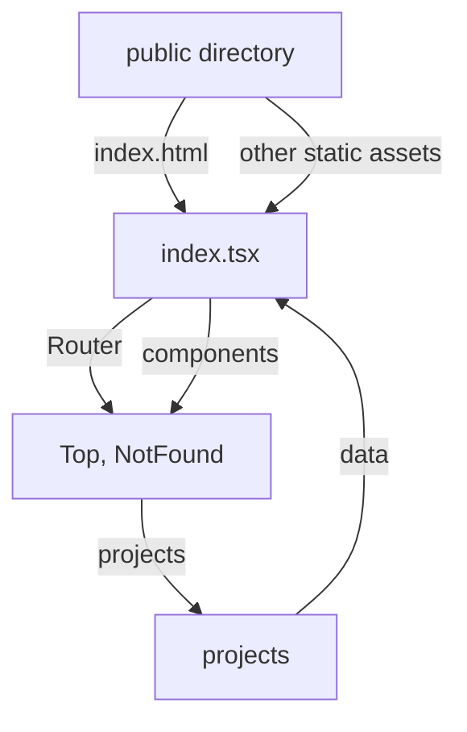

# Create React App Starter Kit

This project is a starter kit for creating React apps. It uses [Create React App](https://github.com/facebook/create-react-app) to bootstrap the project and provides a directory structure and some sample code to get started quickly.

## Available Scripts

In the project directory, you can run:

### `npm start`

Runs the app in development mode.\
Open [http://localhost:3000](http://localhost:3000) to view it in the browser.

The page will reload if you make changes.\
You will also see any lint errors in the console.

### `npm test`

Launches the test runner in interactive watch mode.\
See the [running tests](https://facebook.github.io/create-react-app/docs/running-tests) section for more information.

### `npm run build`

Builds the app for production to the `build` folder.\
It correctly bundles React in production mode and optimizes the build for the best performance.

The build is minified and the filenames include the hashes.\
Your app is now ready for deployment!

See the [deployment](https://facebook.github.io/create-react-app/docs/deployment) section for more information.

### `npm run eject`

**Note: this is a one-way operation. Once you `eject`, you cannot go back!**

If you are not satisfied with the build tool and configuration choices, you can `eject` at any time. This command will remove the single build dependency from your project.

Instead, it will copy all configuration files and the transitive dependencies (webpack, Babel, ESLint, etc.) directly into your project so you have full control over them. All commands except `eject` will still work, but they will point to the copied scripts so you can modify them. At this point, you are on your own.

You do not have to use `eject`. The provided feature set is suitable for small and medium deployments, and you should not feel obligated to use this feature. However, we understand that this tool would not be useful if you could not customize it when you are ready.

## Project Structure

This project is structured as follows:

```
└── portfolio
    ├── README.md
    ├── package-lock.json
    ├── package.json
    ├── public
    │   ├── favicon.ico
    │   ├── index.html
    │   ├── logo192.png
    │   ├── logo512.png
    │   ├── manifest.json
    │   └── robots.txt
    ├── src
    │   ├── NotFound.tsx
    │   ├── Router.tsx
    │   ├── Top.tsx
    │   ├── components
    │   ├── index.css
    │   ├── index.tsx
    │   └── projects
    └── tsconfig.json
```

### `public` directory

The `public` directory contains the HTML file and static assets that are copied to the build directory during production builds.

### `src` directory

The `src` directory contains the source code for the app.

#### `NotFound.tsx`

The `NotFound` component is displayed when a user navigates to a non-existent route.

#### `Router.tsx`

The `Router` component defines the routes for the app using the `react-router-dom` library.

#### `Top.tsx`

The `Top` component is the landing page for the app.

#### `components` directory

The `components` directory contains reusable UI components.

#### `index.css`

The `index.css` file contains global CSS styles for the app.

#### `index.tsx`

The `index` file is the entry point for the app.

#### `projects` directory

The `projects` directory contains code related to displaying information about projects.

## Configuration Diagram



The above diagram shows how the various files and directories in the project are related. The `public` directory contains the `index.html` file and other static assets, which are used by the `index.tsx` file to render the app. The `Router` component routes users to the `Top` or `NotFound` components based on the current URL. The `components` directory contains reusable UI components used by the `Top` and `NotFound` components. The `projects` directory contains code related to displaying information about projects and receives data from the `index.tsx` file.